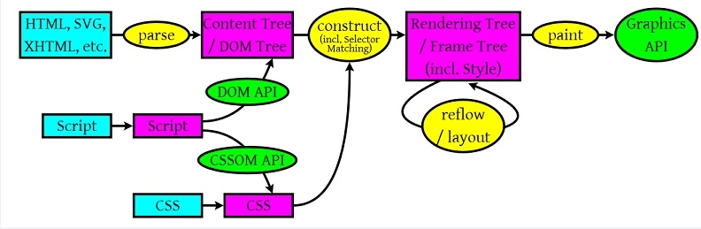

## CSS的重绘和重排

不能用`CSS`通配符 `*`，`CSS`选择器层叠不能超过三层，`CSS`尽量使用类选择器，书写`HTML`少使用`table`，结构要尽量简单-`DOM`树要小,不使用`table`标签等

###  浏览器解析的工作流程



1. **解析HTML以构建DOM树：**渲染引擎开始解析HTML文档，转换树中的html标签或js生成的标签到DOM节点，它被称为 -- 内容树。
2. **构建渲染树：**解析CSS（包括外部CSS文件和样式元素以及js生成的样式），根据CSS选择器计算出节点的样式，创建另一个树 —- 渲染树。
3. **布局渲染树:** 从DOM树的根节点开始遍历每个可见节点。对于每个可见的节点，找到CSSOM树中对应的规则，并应用它们。根据每个可见节点以及其对应的样式，组合生成渲染树。
4. **绘制渲染树:** 遍历渲染树，每个节点将使用UI后端层来绘制。


### 重排

当DOM的变化影响了元素的几何信息(DOM对象的位置和尺寸大小)，浏览器需要重新计算元素的几何属性，将其安放在界面中的正确位置，这个过程称之为**reflow**(也称为回流)

#### 重排比重绘大

**单单改变元素的外观，肯定不会引起网页重新生成布局，但当浏览器完成重排之后，将会重新绘制受到此次重排影响的部分**。

>**"重绘"不一定会出现"重排"，"重排"必然会出现"重绘"**

#### 常见引起重排属性和方法

**任何会改变元素几何信息(元素的位置和尺寸大小)的操作，都会触发重排**:

1. 添加或者删除可见的DOM元素
2. 元素尺寸改变——边距、填充、边框、宽度和高度
3. 内容变化，比如用户在input框中输入文字
4. 浏览器窗口尺寸改变——resize事件发生时
5. 计算 offsetWidth 和 offsetHeight 属性等:


6. 设置 style 属性的值

| 常见引起重排属性和方法  |                          |                    |            |
| ----------------------- | ------------------------ | ------------------ | ---------- |
| width                   | height                   | margin             | padding    |
| display                 | border                   | position           | overflow   |
| clientWidth             | clientHeight             | clientTop          | clientLeft |
| offsetWidth             | offsetHeight             | offsetTop          | offsetLeft |
| scrollWidth             | scrollHeight             | scrollTop          | scrollLeft |
| scrollIntoView()        | scrollTo()               | getComputedStyle() |            |
| getBoundingClientRect() | scrollIntoViewIfNeeded() |                    |            |

#### 重排影响范围

由于浏览器渲染界面是基于流布局模型的，所以触发重排时会对周围DOM重新排列，影响的范围有两种：

- 全局范围：从根节点`html`开始对整个渲染树进行重新布局。

- 局部范围：对渲染树的某部分或某一个渲染对象进行重新布局

**全局范围重排**：

  ```
  <body>
    <div class="hello">
      <h4>hello</h4>
      <p><strong>Name:</strong>BDing</p>
      <h5>male</h5>
      <ol>
        <li>coding</li>
        <li>loving</li>
      </ol>
    </div>
  </body>
  复制代码
  ```

 当p节点上发生reflow时，hello和body也会重新渲染，甚至h5和ol都会收到影响。

**局部范围重排：**

用局部布局来解释这种现象：把一个dom的宽高之类的几何信息定死，然后在dom内部触发重排，就只会重新渲染该dom内部的元素，而不会影响到外界。

### 重绘

当一个元素的外观发生改变，但没有改变布局,重新把元素外观绘制出来的过程，这个过程称之为**repaint**

**常见的引起重绘的属性**:

| 常见引起重绘属性和方法 |                  |                     |                   |
| ---------------------- | ---------------- | ------------------- | ----------------- |
| color                  | border-style     | visibility          | background        |
| text-decoration        | background-image | background-position | background-repeat |
| outline-color          | outline          | outline-style       | border-radius     |
| outline-width          | box-shadow       | background-size     |                   |

### 浏览器的渲染队列

```javascript
div.style.left = '10px';
div.style.top = '10px';
div.style.width = '20px';
div.style.height = '20px';
```

由于浏览器的**渲染队列机制**,理论上会触发4次重排+重绘，因为每一次都改变了元素的几何属性，实际上最后只触发了一次重排

修改了元素的几何属性，导致浏览器触发重排或重绘时。它会把该操作放进渲染队列，等到队列中的操作到了**一定的数量或者到了一定的时间间隔**时，浏览器就会批量执行这些操作

#### 强制刷新队列

```javascript
div.style.left = '10px';
console.log(div.offsetLeft);
div.style.top = '10px';
console.log(div.offsetTop);
div.style.width = '20px';
console.log(div.offsetWidth);
div.style.height = '20px';
console.log(div.offsetHeight);
```

这段代码会触发4次重排+重绘，因为在`console`中你请求的这几个样式信息，无论何时浏览器都会立即执行渲染队列的任务，即使该值与你操作中修改的值没关联

**因为队列中，可能会有影响到这些值的操作，为了给我们最精确的值，浏览器会立即重排+重绘**。

**强制刷新队列的style样式请求**：

1. offsetTop, offsetLeft, offsetWidth, offsetHeight
2. scrollTop, scrollLeft, scrollWidth, scrollHeight
3. clientTop, clientLeft, clientWidth, clientHeight
4. getComputedStyle(), 或者 IE的 currentStyle

### 重排优化

#### 1.分离读写操作

```javascript
div.style.left = '10px';
div.style.top = '10px';
div.style.width = '20px';
div.style.height = '20px';
console.log(div.offsetLeft);
console.log(div.offsetTop);
console.log(div.offsetWidth);
console.log(div.offsetHeight);
```

还是上面触发4次重排+重绘的代码，这次只触发了一次重排：

在第一个`console`的时候，浏览器把之前上面四个写操作的渲染队列都给清空了。剩下的console，因为渲染队列本来就是空的，所以并没有触发重排，仅仅拿值而已。

### 2. 样式集中改变

```
div.style.left = '10px';
div.style.top = '10px';
div.style.width = '20px';
div.style.height = '20px';
```

虽然现在大部分浏览器有渲染队列优化，不排除有些浏览器以及老版本的浏览器效率仍然低下：

建议通过改变class或者csstext属性集中改变样式

```
// bad
var left = 10;
var top = 10;
el.style.left = left + "px";
el.style.top  = top  + "px";
// good 
el.className += " theclassname";
// good
el.style.cssText += "; left: " + left + "px; top: " + top + "px;";
```

### 3. 缓存布局信息

当查询布局信息时，比如获取偏移量（offset）、滚动位置（scroll）或计算出的样式值（computedstyle values）时，浏览器为了返回最新值，会刷新队列并应用所有变更。不利于优化。

所以应该尽量减少布局信息的获取次数，获取后把它赋值给局部变量，然后再操作局部变量

```
// bad 强制刷新 触发两次重排
div.style.left = div.offsetLeft + 1 + 'px';
div.style.top = div.offsetTop + 1 + 'px';

// good 缓存布局信息 相当于读写分离
var curLeft = div.offsetLeft;
var curTop = div.offsetTop;
div.style.left = curLeft + 1 + 'px';
div.style.top = curTop + 1 + 'px';
复制代码
```

### 4. 离线改变dom

- 隐藏要操作的dom

  在要操作dom之前，通过display隐藏dom，当操作完成之后，才将元素的display属性为可见，因为不可见的元素不会触发重排和重绘。

  ```
  dom.display = 'none'
  // 修改dom样式
  dom.display = 'block'
  复制代码
  ```

- 通过使用[DocumentFragment](https://link.juejin.im?target=https%3A%2F%2Fdeveloper.mozilla.org%2Fzh-CN%2Fdocs%2FWeb%2FAPI%2FDocumentFragment)创建一个`dom`碎片,在它上面批量操作dom，操作完成之后，再添加到文档中，这样只会触发一次重排。

- 复制节点，在副本上工作，然后替换它

### 5. position属性为absolute或fixed

position属性为absolute或fixed的元素，重排开销比较小，不用考虑它对其他元素的影响

### 6. 优化动画

- 可以把动画效果应用到position属性为absolute或fixed的元素上，这样对其他元素影响较小

  动画效果还应牺牲一些平滑，来换取速度，这中间的度自己衡量：

  比如实现一个动画，以1个像素为单位移动这样最平滑，但是reflow就会过于频繁，大量消耗CPU资源，如果以3个像素为单位移动则会好很多。

- 启用GPU加速

  此部分来自[优化CSS重排重绘与浏览器性能](https://link.juejin.im?target=http%3A%2F%2Fcaibaojian.com%2Fcss-reflow-repaint.html)

  **GPU(图像加速器)：**

  GPU 硬件加速是指应用 GPU 的图形性能对浏览器中的一些图形操作交给 GPU 来完成，因为 GPU 是专门为处理图形而设计，所以它在速度和能耗上更有效率。

  GPU 加速通常包括以下几个部分：Canvas2D，布局合成, CSS3转换（transitions），CSS3 3D变换（transforms），WebGL和视频(video)。

  ```
  /*
   * 根据上面的结论
   * 将 2d transform 换成 3d
   * 就可以强制开启 GPU 加速
   * 提高动画性能
   */
  div {
    transform: translate3d(10px, 10px, 0);
  }
  ```

### 为什么说DOM操作很慢

DOM对象本身也是一个js对象，所以严格来说，并不是操作这个对象慢，而是说操作了这个对象后，会触发重绘和重排现象