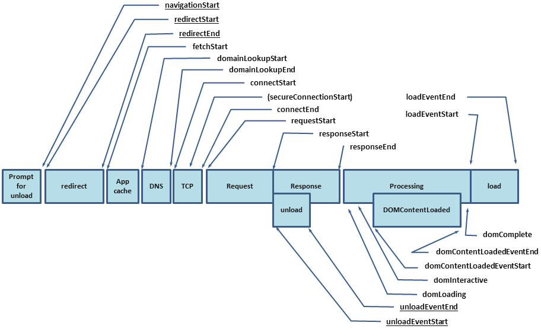
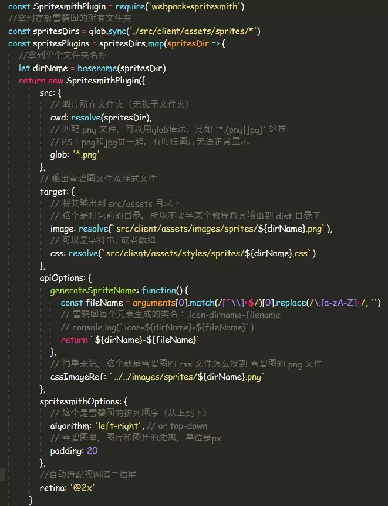

# web性能优化


在开始介绍网络传输性能优化这项工作之前，我们需要了解浏览器处理用户请求的过程：

我们先来看一下页面渲染流程图，每个阶段的用时可以在 `performance.timing` 里查询。

从图中我们可以看出，浏览器在得到用户请求之后，经历了下面这些阶段：重定向 → 拉取缓存 → dns 查询 → 建立 tcp 连接 → 发起请求 → 接收响应 → 处理 html 元素 → 元素加载完成。




我们常将网络性能优化措施归结为三大方面：**减少请求数、减小请求资源体积、提升网络传输速率**。

- 网络传输性能优化
  - 浏览器缓存
  - 使用 http2
  - 资源打包压缩
    - js 压缩
    - html 压缩
    - css 压缩
    - 开启 gzip
  - 图片资源优化
    - 不要在 html 里缩放图像
    - 使用雪碧图（css sprite）
    - 使用字体图标（iconfont）
    - 使用 webp
    - 图片懒加载
  - 使用 cdn
  - 使用预加载
- 页面渲染性能优化
  - 重排与重绘
- 其他优化
  - pc 端
  - 移动端
  - 前后端同构

### 浏览器缓存

浏览器默认的缓存是放在内存中的，但内存里的缓存会因为进程的结束或者说浏览器的关闭而被清除，如果存在硬盘里就能够被长期保留下去。很多时候，我们在 network 面板中各请求的 size 项里，会看到两种不同的状态：_from memory cache_ 和 _from disk cache_，前者指缓存来自内存，后者指缓存来自硬盘。而控制缓存存放位置的是我们在服务器上设置的 etag 字段。在浏览器接收到服务器响应后，会检测响应头部，如果有 etag 字段，那么浏览器就会将本次缓存写入硬盘中。

这里我以nginx为例，谈谈如何配置缓存:

首先，我们先进入nginx的配置文档

```
$ vim nginxPath/conf/nginx.conf
```

在配置文档内插入如下两项：

```
etag on;   //开启etag验证
expires 7d;    //设置缓存过期时间为7天
```

打开我们的网站，在chrome devtools的network面板中观察我们的请求资源，如果在响应头部看见Etag和Expires字段，就说明我们的缓存配置成功了。

**【！！！特别注意！！！】** 在我们配置缓存时一定要切记，浏览器在处理用户请求时，如果命中强缓存，浏览器会直接拉取本地缓存，不会与服务器发生任何通信，也就是说，如果我们在服务器端更新了文件，并不会被浏览器得知，就无法替换失效的缓存。所以我们在构建阶段，需要为我们的静态资源添加md5 hash后缀，避免资源更新而引起的前后端文件无法同步的问题。

### 使用HTTP2

我们都知道，在一次 http 请求中，底层会通过 tcp 建立连接。而 tcp 协议存在 3 次握手，4 次挥手阶段，这些机制保证了 tcp 的可靠性，但降低了传输效率，为了解决这个问题，我们可以使用 http2 来增加传输时候效率。

http2 相比 http1 主要有以下几点优化：

- 多路复用
  - 多个 http 复用一个 tcp 连接，减少 tcp 握手时间。
- 压缩头部
  - 常用的头部字段保存在表里，传输时只需要传递索引值即可。
- 服务器端推送
  - 服务器根据页面内容，主动把页面需要的资源传给客户端，减少请求数。

### 资源打包压缩

我们之前所作的浏览器缓存工作，只有在用户第二次访问我们的页面才能起到效果，如果要在用户首次打开页面就实现优良的性能，必须对资源进行优化。

在对webpack进行上线配置时，我们要特别注意以下几点：

①JS压缩：（这点应该算是耳熟能详了，就不多介绍了）

```
optimization: {
        minimizer: [
            new UglifyJsPlugin({
                cache: true,
                parallel: true,
                sourceMap: true // set to true if you want JS source maps
            }),
            ...Plugins
        ]
    }
```

②HTML压缩：

```
new HtmlWebpackPlugin({
    template: __dirname + '/views/index.html', // new 一个这个插件的实例，并传入相关的参数
    filename: '../index.html',
    minify: {
    removeComments: true,
    collapseWhitespace: true,
    removeRedundantAttributes: true,
    useShortDoctype: true,
    removeEmptyAttributes: true,
    removeStyleLinkTypeAttributes: true,
    keepClosingSlash: true,
    minifyJS: true,
    minifyCSS: true,
    minifyURLs: true,
    },
    chunksSortMode: 'dependency'
})
```

我们在使用`html-webpack-plugin` 自动化注入JS、CSS打包HTML文件时，很少会为其添加配置项，直接复制就行。

PS：这里有一个技巧，在我们书写HTML元素的`src` 或 `href` 属性时，可以省略协议部分，这样也能简单起到节省资源的目的。（虽然其目的本身是为了统一站内的所有协议）

③提取公共资源：

```
splitChunks: {
      cacheGroups: {
        vendor: { // 抽离第三方插件
          test: /node_modules/, // 指定是node_modules下的第三方包
          chunks: 'initial',
          name: 'common/vendor', // 打包后的文件名，任意命名    
          priority: 10 // 设置优先级，防止和自定义的公共代码提取时被覆盖，不进行打包
        },
        utils: { // 抽离自定义公共代码
          test: /\.js$/,
          chunks: 'initial',
          name: 'common/utils',
          minSize: 0 // 只要超出0字节就生成一个新包
        }
      }
    }
```

④提取css并压缩：

在使用webpack的过程中，我们通常会以模块的形式引入css文件（webpack的思想不就是万物皆模块嘛），但是在上线的时候，我们还需要将这些css提取出来，并且压缩，这些看似复杂的过程只需要简单的几行配置就行：

（PS:我们需要用到`mini-css-extract-plugin` ，所以还得大家自行`npm install`）

```
const MiniCssExtractPlugin = require('mini-css-extract-plugin')
module: {
        rules: [..., {
            test: /\.css$/,
            exclude: /node_modules/,
            use: [
                _mode === 'development' ? 'style-loader' : MiniCssExtractPlugin.loader, {
                    loader: 'css-loader',
                    options: {
                        importLoaders: 1
                    }
                }, {
                    loader: 'postcss-loader',
                    options: {
                        ident: 'postcss'
                    }
                }
            ]
        }]
    }
```

我这里配置预处理器postcss，但是我把相关配置提取到了单独的文件`postcss.config.js`里了，其中**cssnano**是一款很不错的CSS优化插件。使用 cssnano 压缩 css。在 postcss.config.js 中进行配置。

```js
const cssnano = require('cssnano');
module.exports = {
  plugins: [cssnano]
};
```


⑤将webpack开发环境修改为生产环境：

在使用webpack打包项目时，它常常会引入一些调试代码，以作相关调试，我们在上线时不需要这部分内容，通过配置剔除：

```
devtool: 'false'
```

如果你能按照上述六点将webpack上线配置完整配置出来，基本能将文件资源体积压缩到极致。

最后，我们还应该在服务器上开启Gzip传输压缩，它能将我们的文本类文件体积压缩至原先的四分之一，效果立竿见影，还是切换到我们的nginx配置文档，添加如下两项配置项目：

```
gzip on;
gzip_types text/plain application/javascript application/x-javascript text/css application/xml text/javascript application/x-httpd-php application/vnd.ms-fontobject font/ttf font/opentype font/x-woff image/svg+xml;
```

**【！！！特别注意！！！】** 不要对图片文件进行Gzip压缩，考虑到服务器压缩过程中的CPU占用还有压缩率等指标，对图片进行压缩不但会占用后台大量资源，压缩效果其实并不可观，可以说是“弊大于利”，所以请在`gzip_types` 把图片的相关项去掉。

### 图片资源优化

而在我们实际开发中，真正占用了大量网络传输资源的，并不是这些文件，而是图片，如果你对图片进行了优化工作，你能立刻看见明显的效果。

#### 不要在HTML里缩放图像

很多开发者可能会有这样的错觉，为了能让用户觉得图片更加清晰，本来为了显示 200x200 的图片，却使用 400x400 的图片，其实不然，在普通的显示器上，用户并不会感到缩放后的大图更加清晰，但这样做会导致网页加载时间变长，同时照成带宽浪费。所以，当你需要用多大的图片时，就在服务器上准备好多大的图片，尽量固定图片尺寸。

:::tip
你可能不知道，一张 200KB 的图片和 2M 的图片的传输时间会是 200m 和 12s 的差距。
:::

#### 使用雪碧图（CSS Sprite）

雪碧图的概念大家一定在生活中经常听见，其实雪碧图是减小请求数的显著运用。而且很奇妙的是，多张图片聘在一块后，总体积会比之前所有图片的体积之和小（你可以亲自试试）。

自动化生成雪碧图的工具：[www.toptal.com/developers/…](https://link.juejin.im/?target=https%3A%2F%2Fwww.toptal.com%2Fdevelopers%2Fcss%2Fsprite-generator) 

其实我们在工程中还有更为自动的方法，便是一款雪碧图生成插件`webpack-spritesmith`。首先，先简单介绍一下使用插件生成雪碧图的思路：

首先，我们会把我们所需要的小图标放置在一个文件夹内以便于管理：（这里的@2x图片是为了适配视网膜二倍屏的图片资源，`webpack-spritesmith`内有专门为适配多倍屏提供的配置项，稍候将会讲到）

然后，我们需要插件去读取这个文件夹内的所有图片资源文件，以文件夹名称为图片名称生成一张雪碧图到指定位置，并且输出能够正确使用这些雪碧图的CSS文件。执行webpack之后，就会在开发目录里生成上面两张图的结果，我们可以看看`common.css`里面的内容：所有我们之前放在common文件夹里的图片资源都自动地生成了相应的样式,先奉上配置内容： （具体可参照`webpack-spritesmith`官方文档： [www.npmjs.com/package/web…](https://link.juejin.im/?target=https%3A%2F%2Fwww.npmjs.com%2Fpackage%2Fwebpack-spritesmith) ）




#### 使用字体图标（iconfont）

不论是压缩后的图片，还是雪碧图，终归还是图片，只要是图片，就还是会占用大量网络传输资源。但是字体图标的出现，却让前端开发者看到了另外一个神奇的世界。

图片能做的很多事情，字体都能作，而且它只是往 html 里插入字符和 css 样式而已，资源占用和图片请求比起来小太多了。

#### 使用 WebP

WebP 格式，是谷歌公司开发的一种旨在加快图片加载速度的图片格式。图片压缩体积大约只有 jpeg 的 2/3，并能节省大量的服务器带宽资源和数据空间。


### 使用 CDN

再好的性能优化实例，也必须在 CDN 的支撑下才能到达极致。CDN 原理如下：

- 根据 DNS 找到离你最近的服务器。
- 数据同步策略：热门资源立即同步，不热门数据谁用谁同步。

执行以下命令查看用户与服务器之间经过的所有路由器：

```sh
# linux
traceroute baidu.com
# windows
tracert baidu.com
```

不言而喻，用户和服务器之间距离越远，经过的路由器越多，延迟也就越高。使用 CDN 的目的之一便是解决这一问题，当然不仅仅如此，CDN 还可以分担 IDC（互联网数据中心） 压力。

### 使用预加载

在 html 加载时，会加载很多第三方资源，这些资源的优先级是不同的，一些重要资源需要提前进行获取，而一些资源可以延迟进行加载。我们可以使用 **DNS 预解析**，**预加载**，**预渲染**来管理页面资源的加载。

```html
<!-- DNS 预解析 -->
<link rel="dns-prefetch" href="//cdfangyuan.cn" />
<!-- 预加载，指明哪些资源是在页面加载完成后即刻需要的，并提前获取-->
<link rel="preload" href="http://example.com" />
<!-- 预渲染，提前加载下一页的数据 -->
<link rel="prerender" href="http://example.com" />
```

## 页面渲染性能优化

具体参考已经写好的[CSS的重绘和重排](https://baotao1997.github.io/blog/css-repaint.html)


## JS阻塞性能


在编程的过程中，如果我们使用了闭包后未将相关资源加以释放，或者引用了外链后未将其置空（比如给某DOM元素绑定了事件回调，后来却remove了该元素），都会造成内存泄漏的情况发生，进而大量占用用户的CPU，造成卡顿或死机。我们可以使用chrome提供的JavaScript Profile版块。

使用JavaScript Profile版块来进行我们的node服务的压力测试，搭配`node-inspector` 插件，我们能更有效地检测JS执行时各函数的CPU占用率，针对性地进行优化。

## 负载均衡

### Node.js处理IO密集型请求

传统的开发模式是“同步”的，前端需要等后端封装好接口，知道了能拿什么数据，再去开发，时间短，工程大。而解耦之后，我们只需要提前约定好接口，前后两端就可以同时开发，不仅高效而且省时。

我们都知道node的核心是事件驱动，通过loop去异步处理用户请求，相比于传统的后端服务，它们都是将用户的每个请求分配到异步队列进行处理，事件驱动的最大优势是什么？就是在高并发IO时，不会造成堵塞，对于直播类网站，这点是至关重要的，我们有成功的先例——快手，快手强大的IO高并发究其本质一定能追溯到node。

### pm2实现Node.js“多线程”

我们都知道node的优劣，这里分享一份链接，找了挺久写的还算详细：[www.zhihu.com/question/19…](https://link.juejin.im/?target=https%3A%2F%2Fwww.zhihu.com%2Fquestion%2F19653241%2Fanswer%2F15993549) 。其实都是老套路，那些说node不行的都是指着node是单线程这一个软肋开撕，告诉你，我们有解决方案了——pm2。这是它的官网：[pm2.keymetrics.io/](https://link.juejin.im/?target=http%3A%2F%2Fpm2.keymetrics.io%2F) 。它是一款node.js进程管理器，具体的功能，就是能在你的计算机里的每一个内核都启动一个node.js服务，也就是说如果你的电脑或者服务器是多核处理器（现在也少见单核了吧），它就能启动多个node.js服务，并且它能够自动控制负载均衡，会自动将用户的请求分发至压力小的服务进程上处理。直接用npm下到全局就可以了`$ npm i pm2 -g`具体的使用方法还有相关特性可以参照官网。这里我在`build`文件夹内添加了`pm2.json`文件，这是pm2的启动配置文件，我们可以自行配置相关参数，具体可参考github源码，运行时我们只要在上线目录下输入命令`$ pm2 start pm2.json`即可。

### nginx搭建反向代理

网站的反向代理就是指那台介于用户和我们真实服务器之间的服务器，它的作用便是能够将用户的请求分配到压力较小的服务器上，其机制是轮询。反向代理是对服务器实现负载均衡，而pm2是对进程实现负载均衡

```
http {
	upstream video {
		ip_hash;
		server localhost:3000;
	}
	server {
		listen: 8080;
		location / {
			proxy_pass: http://video
		}
	}
}
复制代码
```

在nginx中，模块被分为三大类：handler、filter和upstream。而其中的upstream模块，负责完成完成网络数据的接收、处理和转发，也是我们需要在反向代理中用到的模块。

#### upstream配置信息：

upstream关键字后紧跟的标识符是我们自定义的项目名称，通过一对花括号在其中增添我们的配置信息。

`ip_hash` 关键字：控制用户再次访问时是否连接到前一次连接的服务器

`server`关键字：我们真实服务器的地址，这里的内容肯定是需要我们去填写的，不然运维怎么知道你把项目放在那个服务器上了，也不知道你封装了一层node而得去监听3000端口。

#### server配置信息

server是nginx的基本配置，我们需要通过server将我们定义的upstream应用到服务器上。

`listen`关键字：服务器监听的端口

`location`关键字：和我们之前在node层说到的路由是起同样的功能，这里是把用户的请求分配到对应的upstream上

## 其他优化

### PC 端

- 同一个域名下 3 个 js。
- 整个网页首屏加载的 js 5 个。
- gzip 之后每个文件大小不超过 31.2KB~ 最大 100。

### 移动端

- 使用 manifest 配置离线应用。
- 利用 localstrage 缓存数据，容量最大 5M ，不能超过 2.5M。
  - 同步，容量小，读取快。
  - localstrage 扩容计划。 iframe + postmessage。
- 基于 indexdDB 等异步缓存方案。
  - 容量大，读取慢。
- 区分机型 ua，如果机型性能不好，就加载简版页面。
- 网速检测，页面中默认使用 1x 图，如果网速好则用 2x 图。

### 传统页面和单页

- 传统页面。
  - 先加载页面骨架，然后 ajax 请求数据，容易白屏。
- 传统单页。
  - 利用 ajax 拉去数据，通过 hash 或者 history 管理路由，速度快，seo 不友好。
- 前后端同构。
  - pushstate + ajax，首页进行服务器端渲染，页面内部的跳转由 ajax 获取数据渲染。
  - 页面刷新，则直接请求后端，进行服务器端渲染。

## 参考链接

[网站性能优化实战——从 12.67s 到 1.06s 的故事](https://juejin.im/post/5b6fa8c86fb9a0099910ac91)

