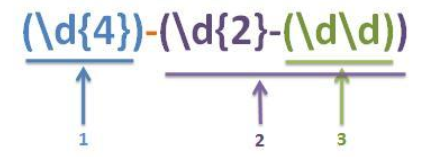
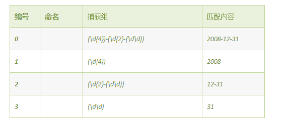

## 正则表达式

一开始我认为正则表达式很简单,结果刷题的时候发现很多不会,比如反向引用,贪婪模式,捕获组等概念,并不清楚,所以在此把JS中的正则表达式好好归纳一下.

### 基础规则

1. 不需要双引号,用**//**直接包含 `/\d/`

2. 用反斜杠**\ **表示转义`/\.jpg$/`

3. **锚点类**

   `/\.jpg$/`:**以".jpg"结尾**

   `/^a/`:**以"a"开头.**

4. **字符类**

   `[abc]`:**a或b或c**

   `[0-9]`:**一个数字**

   `[a-z]`:**一个字母**

   `.`:**任意字符**

5. **元字符**

   `^`:**在[]里面用表示非，在[]外面用表示开头**

   `\d`:**[0-9]**

   `\s`:**空白符**

   `\w`:**[A-Za-z0-9_]**

   `\D`:**[^\d]---非数字**

   `\S`:**非空白符**

6. **量词**

   `{m,n}`:**m到n次**

   `*`:**{0,}**

   `?`:**{0,1}**

   `+`:**{1,}**

### 捕获组

ES6开始支持对捕获组进行命名,在ES5中,我们只能按照`(`的出现顺序,对捕获组进行编号来获取.

例子:`(\d{4})-(\d{2}-(\d\d))`

用这个正则表达式匹配**yyyy-MM-dd**的日期,若匹配2008-12-31,则匹配结果为

### 反向引用

捕获组匹配成功,会将匹配到的内容放到数字编号的组中,简单地认为给局部变量赋值,这个时候可以引用这个局部变量的值.反向引用主要用于查找或限定重复、查找或限定指定标识配对.

例子: 源字符串:`abcdebbcde`  正则表达式:`([ab])\1`

对于正则表达式`([ab])\1`,虽然`[ab]`可以匹配`a`或者`b`,但是一旦匹配成功,反向引用的内容就确定了,由于后面`\1`的限制,要求必须是两个相同的字符,如`aa`或者`bb`才能匹配成功.

正则引擎向前传动,在位置5之前,`([ab])`一直匹配失败,传动到5处,`([ab])`匹配到`b`,然后把控制权交给`\1`,`\1`确定匹配到`b`才能匹配成功,可见满足条件,匹配开始位置是5,结束位置是7.

### 贪婪模式

在使用修饰匹配次数的特殊符号时，有几种表示方法可以使同一个表达式能够匹配不同的次数，比如：`{m,n}`, `{m,}`, `?`, `*`, `+`，具体匹配的次数随被匹配的字符串而定。这种重复匹配不定次数的表达式在匹配过程中，总是尽可能多的匹配。

比如，针对文本 `dxxxdxxxd`，举例如下：

| 表达式      |                           匹配结果                           |
| ----------- | :----------------------------------------------------------: |
| (d)(\w+)    |       "\w+" 将匹配第一个 "d" 之后的所有字符 "xxxdxxxd"       |
| (d)(\w+)(d) | "\w+" 将匹配第一个 "d" 和最后一个 "d" 之间的所有字符 "xxxdxxx"。虽然 "\w+" 也能够匹配上最后一个 "d"，但是为了使整个表达式匹配成功， "\w+" 可以 "让出" 它本来能够匹配的最后一个 "d" |
由此可见，`\w+`在匹配的时候，总是尽可能多的匹配符合它规则的字符。虽然第二个举例中，它没有匹配最后一个 `d`，但那也是为了让整个表达式能够匹配成功。同理，带 `*` 和 `{m,n}` 的表达式都是尽可能地多匹配，带 `?` 的表达式在可匹配可不匹配的时候，也是尽可能的 "要匹配".这种匹配原则就叫作 "贪婪" 模式 。

### 非贪婪模式

在修饰匹配次数的特殊符号后再加上一个 `?` 号，则可以使匹配次数不定的表达式尽可能少的匹配，使可匹配可不匹配的表达式，尽可能的 "不匹配"。这种匹配原则叫作 "非贪婪" 模式。如果少匹配就会导致整个表达式匹配失败的时候，与贪婪模式类似，非贪婪模式会最小限度的再匹配一些，以使整个表达式匹配成功。举例如下，针对文本 `dxxxdxxxd` 举例：

| 表达式       | 匹配结果                                                     |
| ------------ | ------------------------------------------------------------ |
| (d)(\w+?)    | "\w+?" 将尽可能少的匹配第一个 "d" 之后的字符， 结果是："\w+?" 只匹配了一个 "x" |
| (d)(\w+?)(d) | 为了让整个表达式匹配成功，"\w+?" 不得不匹配 "xxx" 才可以让后边的 "d" 匹配， 从而使整个表达式匹配成功。因此，结果是："\w+?" 匹配 "xxx" |

例子:

1. 表达式 `<td>(.*)</td>` 与字符串 `<td>
aa
</td> <td>
bb
</td>` 匹配时，匹配的结果是：成功；匹配到的内容是 `<td>
aa
</td> <td>
bb
</td>` 整个字符串， 表达式中的 `</td>` 将与字符串中最后一个 `</td>` 匹配。 
2. 若使用非贪婪模式,表达式 `<td>(.*?)</td>` 匹配举例1中同样的字符串时，将只得到 `<td>
aa
</td>`， 再次匹配下一个时，可以得到第二个 `<td>
bb
</td>`