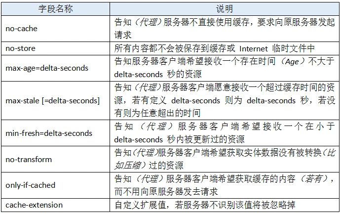
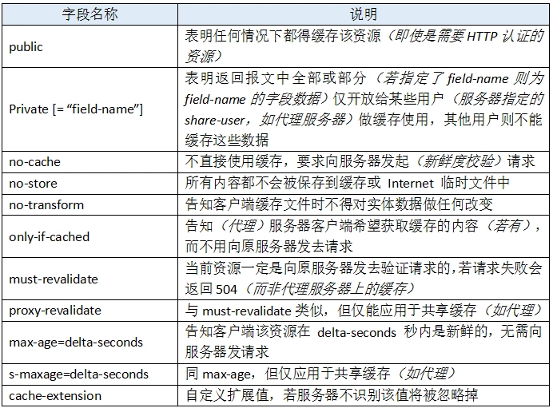
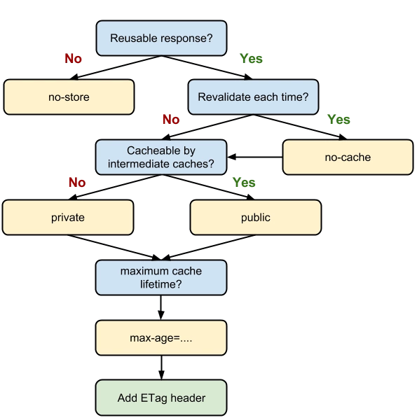
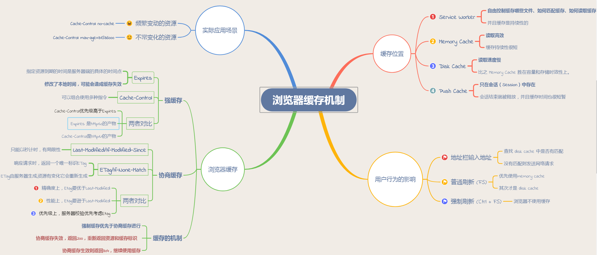

## 浏览器缓存

用户浏览网站的时候，浏览器能够在本地缓存网站中的图片或者其他文件的副本，这样用户再次访问该网站的时候，浏览器就不用再下载全部的文件，减少了下载量意味着提高了页面加载的速度。

### HTTP 1.0: 基于Pragma&Expires的缓存实现

#### Pragma

当该字段值为“no-cache”的时候*（RFC中也仅标明该可选值）*，客户端不要对该资源读缓存，即每次都得向服务器发一次请求才行。Pragma属于通用首部字段，在客户端上使用时，常规要求我们往html上加上这段meta元标签（仅对该页面有效，对页面上的资源无效）：

```
<meta http-equiv="Pragma" content="no-cache">
```

它告诉浏览器每次请求页面时都不要读缓存，都得往服务器发一次请求才行。不过这种限制行为在客户端作用有限：

1. 仅有IE才能识别这段meta标签含义，其它主流浏览器仅能识别“Cache-Control: no-store”的meta标签。
2. 在IE中识别到该meta标签含义，并不一定会在请求字段加上Pragma，但的确会让当前页面每次都发新请求（仅限页面，页面上的资源则不受影响）。

另外，Pragma的优先级是高于Cache-Control 的。

#### Expires

对http1.0而言，Expires就是做这件事的首部字段。Expires的值对应一个GMT（格林尼治时间），比如“Mon, 22 Jul 2019 11:12:01 GMT”来告诉浏览器资源缓存过期时间，如果还没过该时间点则不发请求。在客户端我们同样可以使用meta标签来知会IE（也仅有IE能识别）页面（同样也只对页面有效，对页面上的资源无效）缓存时间：

```
<meta http-equiv="expires" content="mon, 18 apr 2016 14:30:00 GMT">
```

如果希望在IE下页面不走缓存，希望每次刷新页面都能发新请求，那么可以把“content”里的值写为“-1”或“0”。注意的是该方式仅仅作为知会IE缓存时间的标记，你并不能在请求或响应报文中找到Expires字段。如果是在服务端报头返回Expires字段，则在任何浏览器中都能正确设置资源缓存的时间。

**需要注意的是，响应报文中Expires所定义的缓存时间是相对服务器上的时间而言的，其定义的是资源“失效时刻”**，如果客户端上的时间跟服务器上的时间不一致（特别是用户修改了自己电脑的系统时间），那缓存时间可能就没啥意义了。

### HTTP 1.1 Cache-Control:相对过期时间

针对上面服务器和浏览器的时间不统一这个问题，http1.1新增了 Cache-Control 来定义缓存过期时间，若报文中同时出现了Expires 和 Cache-Control，会以 Cache-Control 为准。换言之，这三者的优先级顺序为:Pragma -> Cache-Control -> Expires。

另外 Cache-Control 允许自由组合可选值，例如：

作为请求首部时，cache-directive 的可选值有：



作为响应首部时，cache-directive 的可选值有：



```
Cache-Control: max-age=3600, must-revalidate
```

它意味着该资源是从原服务器上取得的，且其缓存（新鲜度）的有效时间为一小时，在后续一小时内，用户重新访问该资源则无须发送请求。当然这种组合的方式也会有些限制，比如 no-cache 就不能和 max-age、min-fresh、max-stale 一起搭配使用。组合的形式还能做一些浏览器行为不一致的兼容处理。

例如在IE我们可以使用 no-cache 来防止点击“后退”按钮时页面资源从缓存加载，但在 Firefox 中，需要使用 no-store 才能防止历史回退时浏览器不从缓存中去读取数据，故我们在响应报头加上如下组合值即可做兼容处理：

```
Cache-Control: no-cache, no-store
```

### HTTP 1.1 缓存校验

#### 存在的问题

如果客户端向服务器发了请求，那么是否意味着一定要读取回该资源的整个实体内容呢？我们试着这么想——客户端上某个资源保存的缓存时间过期了，但这时候其实服务器并没有更新过这个资源，如果这个资源数据量很大，客户端要求服务器再把这个东西重新发一遍过来，是否非常浪费带宽和时间呢？

缓存校验就是完成这个功能：为了让客户端与服务器之间能实现缓存文件是否更新的验证、提升缓存的复用率。

#### Last-Modified:根据最后修改时间匹配

服务器将资源传递给客户端时，会将资源最后更改的时间以“Last-Modified: GMT”的形式加在实体首部上一起返回给客户端。客户端会为资源标记上该信息，下次再次请求时，会把该信息附带在请求报文中一并带给服务器去做检查，若传递的时间值与服务器上该资源最终修改时间是一致的，则说明该资源没有被修改过，直接返回304状态码即可。至于传递标记起来的最终修改时间的请求报文首部字段一共有两个：

**1. If-Modified-Since: Last-Modified-value**

```
示例为 If-Modified-Since: Thu, 31 Mar 2016 07:07:52 GMT
```

该请求首部告诉服务器如果客户端传来的最后修改时间与服务器上的一致，则直接回送304 和响应报头即可。当前各浏览器均是使用的该请求首部来向服务器传递保存的 Last-Modified 值。

**2. If-Unmodified-Since: Last-Modified-value**

告诉服务器，若Last-Modified没有匹配上*（资源在服务端的最后更新时间改变了）*，则应当返回412(Precondition Failed) 状态码给客户端。

当遇到下面情况时，If-Unmodified-Since 字段会被忽略：

```
1. Last-Modified值对上了（资源在服务端没有新的修改）；
2. 服务端需返回2XX和412之外的状态码；
3. 传来的指定日期不合法
```

Last-Modified 说好却也不是特别好，因为如果在服务器上，一个资源被修改了，但其实际内容根本没发送改变，会因为Last-Modified时间匹配不上而返回了整个实体给客户端*（即使客户端缓存里有个一模一样的资源）*。

#### ETag:根据资源标识符匹配

为了解决上述Last-Modified可能存在的不准确的问题，Http1.1还推出了 ETag 实体首部字段。服务器会通过某种算法，给资源计算得出一个唯一标志符*（比如md5标志）*，在把资源响应给客户端的时候，会在实体首部加上“ETag: 唯一标识符”一起返回给客户端。客户端会保留该 ETag 字段，并在下一次请求时将其一并带过去给服务器。服务器只需要比较客户端传来的ETag跟自己服务器上该资源的ETag是否一致，就能很好地判断资源相对客户端而言是否被修改过了。

如果服务器发现ETag匹配不上，那么直接以常规GET 200回包形式将新的资源*（当然也包括了新的ETag）*发给客户端；如果ETag是一致的，则直接返回304知会客户端直接使用本地缓存即可。

那么客户端是如何把标记在资源上的 ETag 传去给服务器的呢？请求报文中有两个首部字段可以带上 ETag 值：

**1. If-None-Match: ETag-value**

```
示例为 If-None-Match: "56fcccc8-1699"
```

告诉服务端如果 ETag 没匹配上需要重发资源数据，否则直接回送304和响应报头即可。当前各浏览器均是使用的该请求首部来向服务器传递保存的 ETag 值。

**2. If-Match: ETag-value**

告诉服务器如果没有匹配到ETag，或者收到了“*”值而当前并没有该资源实体，则应当返回412(Precondition Failed) 状态码给客户端。否则服务器直接忽略该字段。If-Match 的一个应用场景是，客户端走PUT方法向服务端请求上传/更替资源，这时候可以通过 If-Match 传递资源的ETag。

需要注意的是，如果资源是走分布式服务器（比如CDN）存储的情况，需要这些服务器上计算ETag唯一值的算法保持一致，才不会导致明明同一个文件，在服务器A和服务器B上生成的ETag却不一样。

如果 Last-Modified 和 ETag 同时被使用，则要求它们的验证都必须通过才会返回304，若其中某个验证没通过，则服务器会按常规返回资源实体及200状态码。

在较新的 nginx 上默认是同时开启了这两个功能的：


上图的前三条请求是原始请求，接着的三条请求是刷新页面后的新请求，在发新请求之前我们修改了 reset.css 文件，所以它的 Last-Modified 和 ETag 均发生了改变，服务器因此返回了新的文件给客户端*（状态值为200）*。

而 dog.jpg 我们没有做修改，其Last-Modified 和 ETag在服务端是保持不变的，故服务器直接返回了304状态码让客户端直接使用缓存的 dog.jpg 即可，没有把实体内容返回给客户端*（因为没必要）*。

### 缓存策略



按照上面的决策树来确定您的应用使用的特定资源或一组资源的最优缓存策略。理想情况下，目标应该是在客户端上缓存尽可能多的响应、缓存尽可能长的时间，并且为每个响应提供验证令牌，以便进行高效的重新验证。

| Cache-Control 指令   | 说明                                                         |
| -------------------- | ------------------------------------------------------------ |
| max-age=86400        | 浏览器和任何中继缓存均可以将响应（如果是public的）缓存长达一天（60 秒 x 60 分 x 24 小时） |
| private, max-age=600 | 客户端浏览器只能将响应缓存最长 10 分钟（60 秒 x 10 分）      |
| no-store             | 不允许缓存响应，每个请求必须获取完整的响应                   |


当我们在一个项目上做http缓存的应用时，我们还是会把上述提及的大多数首部字段均使用上，例如使用 Expires 来兼容旧的浏览器，使用 Cache-Control 来更精准地利用缓存，然后开启 ETag 跟 Last-Modified 功能进一步复用缓存减少流量。

Expires 和 Cache-Control 的值应设置为多少合适呢？这个需要按需评估。

例如页面链接的请求常规是无须做长时间缓存的，从而保证回退到页面时能重新发出请求，百度首页是用的 Cache-Control:private，腾讯首页则是设定了60秒的缓存，即 Cache-Control:max-age=60。

而静态资源部分，特别是图片资源，通常会设定一个较长的缓存时间，而且这个时间最好是可以在客户端灵活修改的。以腾讯的某张图片为例：`http://i.gtimg.cn/vipstyle/vipportal/v4/img/common/logo.png?max_age=2592000`
客户端可以通过给图片加上“max_age”的参数来定义服务器返回的缓存时间。

### 废弃和更新已缓存的响应

**然而，如果我们希望更新或废弃已缓存的响应，该怎么办？**

例如，假设我们已经告诉访问者某个 CSS 样式表缓存长达 24 小时 (max-age=86400)，但是设计人员刚刚提交了一个更新，我们希望所有用户都能使用。我们该如何通知所有访问者缓存的 CSS 副本已过时，需要更新缓存？ 这是一个欺骗性的问题 - 实际上，至少在不更改资源网址的情况下，我们做不到。

一旦浏览器缓存了响应，在过期以前，将一直使用缓存的版本，这是由 max-age 或者 expires 指定的，或者直到因为某些原因从缓存中删除，例如用户清除了浏览器缓存。因此，在构建网页时，不同的用户可能使用的是文件的不同版本；刚获取该资源的用户将使用新版本，而缓存过之前副本（但是依然有效）的用户将继续使用旧版本的响应。

**所以，我们如何才能鱼和熊掌兼得：客户端缓存和快速更新？** 很简单，在资源内容更改时，我们可以更改资源的网址，强制用户下载新响应。通常情况下，可以通过在文件名中嵌入文件的指纹码（或版本号）来实现 - 例如 style.**x234dff**.css。

当然这需要有一个前提——静态资源能确保长时间不做改动。如果一个脚本文件响应给客户端并做了长时间的缓存，而服务端在近期修改了该文件的话，缓存了此脚本的客户端将无法及时获得新的数据。

把服务侧ETag的那一套也搬到前端来用——页面的静态资源以版本形式发布，常用的方法是在文件名或参数带上一串md5或时间标记符：

```
https://hm.baidu.com/hm.js?e23800c454aa573c0ccb16b52665ac26
http://tb1.bdstatic.com/tb/_/tbean_safe_ajax_94e7ca2.js
http://img1.gtimg.com/ninja/2/2016/04/ninja145972803357449.jpg
```

如果文件被修改了，才更改其标记符内容，这样能确保客户端能及时从服务器收取到新修改的文件。

因为能够定义每个资源的缓存策略，所以，我们可以定义’缓存层级’，这样，不但可以控制每个响应的缓存时间，还可以控制访问者看到新版本的速度。例如，我们一起分析一下上面的例子：

- HTML 被标记成`no-cache`，这意味着浏览器在每次请求时都会重新验证文档，如果内容更改，会获取最新版本。同时，在 HTML 标记中，我们在 CSS 和 JavaScript 资源的网址中嵌入指纹码：如果这些文件的内容更改，网页的 HTML 也会随之更改，并将下载 HTML 响应的新副本。
- 允许浏览器和中继缓存（例如 CDN）缓存 CSS，过期时间设置为 1 年。注意，我们可以放心地使用 1 年的’远期过期’，因为我们在文件名中嵌入了文件指纹码：如果 CSS 更新，网址也会随之更改。
- JavaScript 过期时间也设置为 1 年，但是被标记为 private，也许是因为包含了 CDN 不应缓存的一些用户私人数据。
- 缓存图片时不包含版本或唯一指纹码，过期时间设置为 1 天。

### 缓存检查表

在定义缓存策略时，要记住下列技巧和方法：

1. **使用一致的网址：**如果您在不同的网址上提供相同的内容，将会多次获取和存储该内容。
2. **确保服务器提供验证令牌 (ETag)：**通过验证令牌，如果服务器上的资源未被更改，就不必传输相同的字节。
3. **确定中继缓存可以缓存哪些资源：**对所有用户的响应完全相同的资源很适合由 CDN 或其他中继缓存进行缓存。
4. **确定每个资源的最优缓存周期：**不同的资源可能有不同的更新要求。审查并确定每个资源适合的 max-age。
5. **确定网站的最佳缓存层级：**对 HTML 文档组合使用包含内容指纹码的资源网址以及短时间或 no-cache 的生命周期，可以控制客户端获取更新的速度。
6. **搅动最小化：**有些资源的更新比其他资源频繁。如果资源的特定部分（例如 JavaScript 函数或一组 CSS 样式）会经常更新，应考虑将其代码作为单独的文件提供。这样，每次获取更新时，剩余内容（例如不会频繁更新的库代码）可以从缓存中获取，确保下载的内容量最少。

### 用户行为对浏览器缓存的影响

>1. 打开网页，地址栏输入地址： 查找 disk cache 中是否有匹配。如有则使用；如没有则发送网络请求。
>2. 普通刷新 (F5)：因为 TAB 并没有关闭，因此 memory cache 是可用的，会被优先使用(如果匹配的话)。其次才是 disk cache。
>3. 强制刷新 (Ctrl + F5)：浏览器不使用缓存，因此发送的请求头部均带有 Cache-control: no-cache(为了兼容，还带了 Pragma: no-cache),服务器直接返回 200 和最新内容。
>



## 参考文献

1. [HTTP Cache解析](https://juejin.im/post/5c8f47255188252dac6d261b#heading-7 )

2. [HTTP 缓存的四种风味与缓存策略](https://segmentfault.com/a/1190000006689795)

3. [浅谈浏览器http的缓存机制](https://www.cnblogs.com/vajoy/p/5341664.html)


