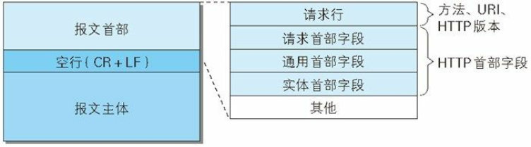
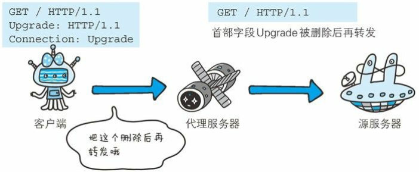

## HTTP报文结构解析

图解HTTP讲的真的是通俗易懂,当时没仔细理解,现在重新看,发现忽略了很多内容

### HTTP请求报文



```
GET / HTTP/1.1
Host: hackr.jp
User-Agent: Mozilla/5.0 (Windows NT 6.1; WOW64; rv:13.0) Gecko/2010010
Accept: text/html,application/xhtml+xml,application/xml;q=0.9,*/*; q=0
Accept-Language: ja,en-us;q=0.7,en;q=0.3
Accept-Encoding: gzip, deflate
DNT: 1
Connection: keep-alive
If-Modified-Since: Fri, 31 Aug 2007 02:02:20 GMT
If-None-Match: "45bae1-16a-46d776ac"
Cache-Control: max-age=0
```

### HTTP响应报文


```
HTTP/1.1 304 Not Modified
Date: Thu, 07 Jun 2012 07:21:36 GMT
Server: Apache
Connection: close
Etag: "45bae1-16a-46d776ac"
```

上图可见,首部字段有四种:请求首部字段 ,响应首部字段 ,通用首部字段 ,实体首部字段

### 请求首部字段

| 首部字段名          | 说明                                                         |
| ------------------- | ------------------------------------------------------------ |
| Accept              | 用户代理可处理的媒体类型                                     |
| Accept-Charset      | 优先的字符集                                                 |
| Accept-Encoding     | 优先的内容编码                                               |
| Accept-Language     | 优先的语言（自然语言）                                       |
| Authorization       | Web认证信息                                                  |
| Expect              | 期待服务器的特定行为                                         |
| From                | 用户的电子邮箱地址                                           |
| Host                | 请求资源所在服务器<br />在 HTTP/1.1 规范内是唯一一个必须被包含在请求内的首部字段<br />相同的 IP 地址下部署运行多个域名， 服务器就会无法理解究竟是哪个域名对应的请求。因此， 就需要使用首部字段 Host 来明确指出请求的主机名。 若服务器未设定主机名， 那直接发送一个空值即可 |
| If-Match            | 比较实体标记（ETag）<br />服务器会比对 If-Match 的字段值和资源的 ETag 值， 仅当两者一致时， 才会执行请求。 反之， 则返回状态码 412 (Precondition Failed )的响应,使用*忽略ETag值 |
| If-Modified-Since   | 比较资源的更新时间                                           |
| If-None-Match       | 比较实体标记（与 If-Match 相反）                             |
| If-Range            | 资源未更新时发送实体 Byte 的范围请求<br />ETag值与If-Range字段值相同,则返回Range选中的内容,若不一致,则返回所有内容 |
| If-Unmodified-Since | 比较资源的更新时间（与If-Modified-Since相反）                |
| Max-Forwards        | 最大传输逐跳数                                               |
| Proxy-Authorization | 代理服务器要求客户端的认证信息                               |
| Range               | 实体的字节范围请求                                           |
| Referer             | 对请求中 URI 的原始获取方                                    |
| TE                  | 传输编码的优先级                                             |
| User-Agent          | HTTP 客户端程序的信息                                        |

### 响应首部字段

| 首部字段名         | 说明                                                         |
| ------------------ | ------------------------------------------------------------ |
| Accept-Ranges      | 是否接受字节范围请求<br />可处理范围请求时指定其为 bytes， 反之则指定其为 none |
| Age                | 推算资源创建经过时间                                         |
| ETag               | 资源的匹配信息                                               |
| Location           | 令客户端重定向至指定URI<br />配合 3xx ： Redirection 的响应， 提供重定向的URI |
| Proxy-Authenticate | 代理服务器对客户端的认证信息                                 |
| Retry-After        | 对再次发起请求的时机要求                                     |
| Server             | HTTP服务器的安装信息                                         |
| Vary               | 代理服务器缓存的管理信息<br />仅对请求中含有相同 Vary 指定首部字段的请求返回缓存 |
| WWW-Authenticate   | 服务器对客户端的认证信息<br />状态码 401 Unauthorized 响应中，肯定带有首部字段 WWW-Authenticate |

### 通用首部字段

| 首部字段名        | 说明                                                         |
| ----------------- | ------------------------------------------------------------ |
| Cache-Control     | 控制缓存的行为                                               |
| Connection        | 逐跳首部、 连接的管理                                        |
| Date              | 创建报文的日期时间                                           |
| Pragma            | 报文指令,仅作为与 HTTP/1.0的向后兼容而定义<br />Pragma: no-cache形式唯一 |
| Trailer           | 报文末端的首部一览                                           |
| Transfer-Encoding | 指定报文主体的传输编码方式<br />`Transfer-Encoding: chunked`分块编码传输 |
| Upgrade           | 升级为其他协议<br />使用首部字段 Upgrade 时， 还需要额外指定`Connection:Upgrade`仅对邻接服务器有关 |
| Via               | 代理服务器的相关信息                                         |
| Warning           | 错误通知                                                     |

#### Cache-Control

请求指令

| 指令                | 参数   | 说明                                                         |
| ------------------- | ------ | ------------------------------------------------------------ |
| **no-cache**        | 无     | 强制向源服务器再次验证<br />使用 no-cache 指令的目的是为了防止从缓存中返回过期的资源<br />表示客户端将不会接收缓存过的响应 |
| **no-store**        | 无     | 不缓存请求或响应的任何内容                                   |
| **max-age = [ 秒]** | 必需   | 响应的最大Age值                                              |
| max-stale( = [ 秒]) | 可省略 | 接收已过期的响应                                             |
| min-fresh = [ 秒]   | 必需   | 期望在指定时间内的响应仍有效                                 |
| no-transform        | 无     | 代理不可更改媒体类型                                         |
| only-if-cached      | 无     | 从缓存获取资源<br />缓存服务器不重新加载响应， 也不会再次确认资源有效性<br />请求缓存服务器的本地缓存无响应， 则返回状态码 504 |
| cache-extension     | -      | 新指令标记（token）                                          |

响应指令

| 指令                 | 参数   | 说明                                                         |
| -------------------- | ------ | ------------------------------------------------------------ |
| **public**           | 无     | 可向任意方提供响应的缓存                                     |
| **private**          | 可省略 | 仅向特定用户返回响应                                         |
| **no-cache**         | 可省略 | 缓存前必须先确认其有效性<br />源服务器以后也将不再对缓存服务器请求中提出的资源有效性进行确认， 且禁止其对响应资源进行缓存操作<br />`Cache-Control: no-cache=Location`可以通过响应报文指定参数来控制 |
| no-store             | 无     | 不缓存请求或响应的任何内容                                   |
| no-transform         | 无     | 代理不可更改媒体类型                                         |
| **must-revalidate**  | 无     | 可缓存但必须再向源服务器进行确认,若无法获取则返回504         |
| **proxy-revalidate** | 无     | 要求中间缓存服务器对缓存的响应有效性再进行确认               |
| max-age = [ 秒]      | 必需   | 响应的最大Age值                                              |
| s-maxage = [ 秒]     | 必需   | 公共缓存服务器响应的最大Age值<br />与`max-age`指令功能相同,但是只适用于供多位用户使用的公共缓存服务器,对单个用户没有任何作用 |
| cache-extension      | -      | 新指令标记（token）                                          |

#### Connection 

- 控制不再转发给代理的首部字段 
- 管理持久连接 

`Connection: 不再转发的首部字段名 `




HTTP/1.1 版本的默认连接都是持久连接 ,即为`Connection: Keep-Alive `,若想关闭连接,指定为`Connection: close `

### 实体首部字段 

| 首部字段名       | 说明                                                         |
| ---------------- | ------------------------------------------------------------ |
| Allow            | 资源可支持的HTTP方法                                         |
| Content-Encoding | 实体主体适用的编码方式                                       |
| Content-Language | 实体主体的自然语言                                           |
| Content-Length   | 实体主体的大小（单位： 字节）                                |
| Content-Location | 替代对应资源的URI                                            |
| Content-MD5      | 实体主体的报文摘要<br />对报文主体执行 MD5 算法获得的 128 位二进制数， 再通过 Base64 编码后将结果写入 Content-MD5 字段值,查看报文传输过程是否完整 |
| Content-Range    | 实体主体的位置范围                                           |
| Content-Type     | 实体主体的媒体类型                                           |
| Expires          | 实体主体过期的日期时间                                       |
| Last-Modified    | 资源的最后修改日期时间                                       |

#### Content-Type

`application/x-www-form-urlencoded`：数据被编码为名称/值对。这是标准的编码格式。
`multipart/form-data`： 数据被编码为一条消息，页上的每个控件对应消息中的一个部分。
`text/plain`： 数据以纯文本形式(text/json/xml/html)进行编码，其中不含任何控件或格式字符。postman软件里标的是RAW。

当action为get时候，浏览器用`x-www-form-urlencoded`的编码方式把form数据转换成一个字串（name1=value1&name2=value2...），然后把这个字串追加到url后面，用`?`分割，加载这个新的url。

当action为post时候，浏览器把form数据封装到http body中，然后发送到server。 如果没有`type=file`的控件，用默认的application/x-www-form-urlencoded就可以了。 但是如果有`type=file`的话，就要用到multipart/form-data了。

当action为post且Content-Type类型是`multipart/form-data`，浏览器会把整个表单以控件为单位分割，并为每个部分加上Content-Disposition(form-data或者file),Content-Type(默认为text/plain),name(控件`name`)等信息，并加上分割符(boundary)。

**Cookie、 Set-Cookie 和 Content-Disposition 使用频率也很高**

| 首部字段名 | 说明                           | 首部类型     |
| ---------- | ------------------------------ | ------------ |
| Set-Cookie | 开始状态管理所使用的Cookie信息 | 响应首部字段 |
| Cookie     | 服务器接收到的Cookie信息       | 请求首部字段 |

####  Set-Cookie

| 属性         | 说明                                                         |
| ------------ | ------------------------------------------------------------ |
| NAME=VALUE   | 赋予 Cookie 的名称和其值（必需项）                           |
| expires=DATE | Cookie 的有效期（若不明确指定则默认为浏览器关闭前为止）      |
| path=PATH    | 将服务器上的文件目录作为Cookie的适用对象（若不指定则默 认为文档所在的文件目录） |
| domain=域名  | 作为 Cookie 适用对象的域名 （若不指定则默认为创建 Cookie 的服务器的域名） |
| Secure       | 仅在 HTTPS 安全通信时才会发送 Cookie                         |
| HttpOnly     | 加以限制， 使 Cookie 不能被 JavaScript 脚本访问              |