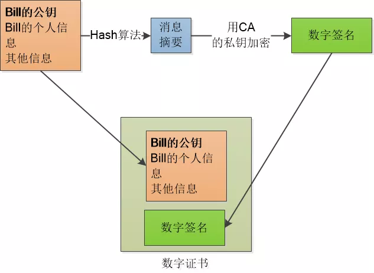

## DNS查询的过程

输入`https://baotao1997.github.io/`怎么返回IP地址?**DNS**实际上就是域名和IP对应的电话本,可以这么理解,那**DNS**的查询过程分为下面几步:

1. 浏览器搜索自己的 DNS 缓存（浏览器维护一张域名与 IP 地址的对应表）；如果没有命中，进入下一步
2. 搜索操作系统中的 DNS 缓存；如果没有命中，进入下一步
3. 搜索操作系统的 hosts 文件（ Windows 环境下，维护一张域名与 IP 地址的对应表）；如果没有命中，进入下一步；
4. 具体如下:

```
1.操作系统将域名发送至 LDNS （本地区域名服务器），LDNS 查询自己的 DNS 缓存（一般命中率在 80% 左右），查找成功则返回结果，失败则发起一个迭代 DNS 解析请求：
2.LDNS向 Root Name Server（根域名服务器，如com、net、io 等的顶级域名服务器的地址）发起请求，此处，Root Name Server 返回 io 域的顶级域名服务器的地址；
LDNS 向 io 域的顶级域名服务器发起请求，返回 github.io 域名服务器地址；
LDNS 向 github.io 域名服务器发起请求，得到 baotao1997.github.io 的 IP 地址；
LDNS 将得到的 IP 地址返回给操作系统，同时自己也将 IP 地址缓存起来；操作系统将 IP 地址返回给浏览器，同时自己也将 IP 地址缓存起来。
```


### DNS优化

一般来说，在前端优化中与 DNS 有关的有两点：

1. 减少 DNS 的请求次数
2. 进行 DNS 预获取

#### 如何减少DNS的请求次数呢?

本身DNS缓存是有时间限制的,缓存时间较长，有利于重复利用DNS缓存，提高速度,而缓存时间较短，有利于及时地检测到目标站点的IP地址更新，以进行正确的访问

**减少DNS查找次数，最理想的方法就是将所有的内容资源都放在同一个域(Domain)下面**

而HTTP /1.1 中推荐客户端针对每个域只有一定数量的并行度（它的建议是2），那么就会出现下载资源时的排队现象，这样就会降低性能

**一个网站里面使用至少2个域，但不多于4个域**来提供资源

#### DNS Prefetch

典型的一次 DNS 解析需要耗费 20-120 毫秒，减少DNS解析时间和次数是个很好的优化方式。DNS Prefetching 是让具有此属性的域名不需要用户点击链接就在后台解析，而域名解析和内容载入是串行的网络操作，所以这个方式能减少用户的等待时间，提升用户体验。

浏览器本身会对预解析做一定的优化设置,要使用的话,使用方法很简单:

```html
// 一般放在 <meta charset="UTF-8"> 后面
<meta http-equiv="x-dns-prefetch-control" content="on">
<link rel="dns-prefetch" href="//www.zhix.net">
<link rel="dns-prefetch" href="//api.share.zhix.net">
<link rel="dns-prefetch" href="//bdimg.share.zhix.net">
```

如果要禁止的话,使用`<meta http-equiv="x-dns-prefetch-control" content="off">`

## HTTP常见的状态码

状态码告知从服务器端返回的请求结果 ,常见的状态码有404页面不存在，500服务器错误，301重定向，302临时重定向，200ok，401未授权,类别分别为:

|      | 类别         | 原因短语                   |
| ---- | ------------ | -------------------------- |
| 1XX  | 信息性状态码 | 接收的请求正在处理         |
| 2XX  | 成功         | 请求正常处理完毕           |
| 3XX  | 重定向       | 需要进行附加操作以完成请求 |
| 4XX  | 客户端错误   | 服务器无法处理请求         |
| 5XX  | 服务端错误   | 服务器处理请求出错         |

### 2XX 成功

#### 200 OK

表示从客户端发来的请求在服务器端被正常处理了 

#### 204 No Content

该状态码代表服务器接收的请求已成功处理， 但在返回的响应报文中不含实体的主体部分。 另外， 也不允许返回任何实体的主体。 **浏览器显示的页面不发生更新** 

#### 206 Partial Content

该状态码表示客户端进行了范围请求， 而服务器成功执行了这部分的GET 请求。 响应报文中包含由 Content-Range 指定范围的实体内容。 

### 3XX 重定向

- 网站调整（如改变网页目录结构）；
-  网页被移到一个新地址；
-  网页扩展名改变(如应用需要把.php改成.Html或.shtml)。

这种情况下，如果不做重定向，则用户收藏夹或搜索引擎数据库中旧地址只能让访问客户得到一个404页面错误信息，访问流量白白丧失；再者某些注册了多个域名的网站，也需要通过重定向让访问这些域名的用户自动跳转到主站点等。

#### 301 Moved Permanently 

永久性重定向。 该状态码表示请求的资源已被分配了新的 URI， 以后应使用资源现在所指的 URI 。

##### 301 适合永久重定向

　　比如，我们访问 **http**://www.baidu.com 会跳转到 **https**://www.baidu.com，发送请求之后，就会返回301状态码，然后返回一个location，提示新的地址，浏览器就会拿着这个新的地址去访问。 

**注意： 301请求是可以缓存的， 即通过看status code，可以发现后面写着from cache。**

**或者你把你的网页的名称从php修改为了html，这个过程中，也会发生永久重定向。**

#### 302 Found 

临时性重定向。 该状态码表示请求的资源已被分配了新的 URI， 希望用户（本次） 能使用新的 URI 访问。 

用户把 URI 保存成书签， 但不会像 301 状态码出现时那样去更新书签， 而是仍旧保留返回 302 状态码的页面对应的 URI 。

##### 302 用于做临时跳转

比如未登陆的用户访问用户中心重定向到登录页面。

访问404页面会重新定向到首页。 

\##niginx 301/302配置

rewrite后面接上permenent就代表301跳

```
//把来自veryyoung.me的请求301跳到 www.veryyoung.me
if ($host != 'veryyoung.me') {
    rewrite ^/(.*)$ http://www.veryyoung.me/$1 permanent;
}
```

接上redirect就代表302跳

```
//把来自veryyoung.me的请求302跳到 www.veryyoung.me
if ($host != 'veryyoung.me') {
    rewrite ^/(.*)$ http://www.veryyoung.me/$1 redirect;
}
```

>一般情况下非特意临时性URL转移，都尽量用301跳转，这样的一个好处是搜索引擎会把该URL的PR值都带到跳转后的地址,同时会减少网址劫持
>
>搜索引擎对302跳转进行判断的时候，如果发现跳转目标页面URL更加复杂，就会返回来对原URL进行访问，寻取一个简单友好的地址，这样无形会加重服务器性能损耗

#### 303 See Other 

303 状态码和 302 Found 状态码有着相同的功能， 但 303 状态码明确表示客户端应当采用 GET 方法获取资源 

>当 301、 302、 303 响应状态码返回时， 几乎所有的浏览器都会把POST 改成 GET， 并删除请求报文内的主体， 之后请求会自动再次发送 

#### 304 Not Modified 

该状态码表示客户端发送附带条件的请求时， 服务器端允许请求访问资源， 但未满足条件的情况。 

#### 307 Temporary Redirect 

临时重定向。 该状态码与 302 Found 有着相同的含义 ,307 会遵照浏览器标准， 不会从 POST 变成 GET。 

### 4XX 客户端错误 

#### 400 Bad Request 

该状态码表示请求报文中存在语法错误。 当错误发生时， 需修改请求的内容后再次发送请求 

#### 401 Unauthorized 

该状态码表示发送的请求需要有通过 HTTP 认证,若之前已进行过 1 次请求， 则表示用 户认证失败 

#### 403 Forbidden

该状态码表明对请求资源的访问被服务器拒绝了 

#### 404 Not Found 

该状态码表明服务器上无法找到请求的资源 

### 5XX 服务器错误 

#### 500 Internal Server Error

该状态码表明服务器端在执行请求时发生了错误。 也有可能是 Web应用存在的 bug 或某些临时的故障 

#### 503 Service Unavailable 

该状态码表明服务器暂时处于超负载或正在进行停机维护， 现在无法处理请求 

## 面试重点相关的状态码

重点介绍三个状态码及相关的知识，他们分别是304协商缓存，101协议升级，以及307hsts跳转

#### 304协商缓存

先从304协商缓存开始吧。这是比较基础的知识。只要你提起304协商缓存，面试官一定会问什么是协商缓存？

这时就到了你展示一下自己丰富的浏览器缓存知识的时候了。我一般会这么答：浏览器缓存分为强制缓存和协商缓存，优先读取强制缓存。

强制缓存分为expires和cache-control，而expires是一个特定的时间，是比较旧的标准和cache-control通常是一个具体的时间长度，比较新，优先级也比较高。

而协商缓存包括etag和last-modified，last-modified的设置标准是资源的上次修改时间，而etag是为了应对资源修改时间可能很频繁的情况出现的，是基于资源的内容计算出来的值，因此优先级也较高。

协商缓存与强制缓存的区别在于强制缓存不需要访问服务器，返回结果是200，协商缓存需要访问服务器，如果命中缓存的话，返回结果是304。

#### 101协议升级

先发送一个普通的请求（[`GET`](https://developer.mozilla.org/zh-CN/docs/Web/HTTP/Methods/GET)，[`POST`](https://developer.mozilla.org/zh-CN/docs/Web/HTTP/Methods/POST)等），不过这个请求需要进行特殊配置以包含升级请求

在请求头中额外添加`Connection: Upgrade`指示这是一个升级请求;
`Upgrade: protocols`
`Upgrade` 头指定一项或多项协议名，按优先级排序，以逗号分隔。

##### 升级到HTTP2

```javascript
// 升级为Http2
GET / HTTP/1.1
Host: destination.server.ext
Connection: Upgrade, HTTP2-Settings
Upgrade: h2c
HTTP2-Settings: base64EncodedSettings
// 如果不支持Http2
HTTP/1.1 200 OK
// 支持HTTP2
HTTP/1.1 101 Switching Protocols
Connection: Upgrade
Upgrade: h2c
```

##### 升级到WebSocket

```javascript
webSocket = new WebSocket("ws://destination.server.ext", "optionalProtocol");
//  WebSocket构造函数则完成HTTP/1.1的握手连接过程并进行升级

// 你也可以用wss://来打开一个websocket连接
Connection: Upgrade
Upgrade: websocket
// 不安全（HTTP）客户端希望升级时，可以使用此标头，以便提供某种程度的防止滥用websocket
Sec-WebSocket-Key: key
Sec-WebSocket-Protocol: subprotocols // 使用的websocket服务
Sec-WebSocket-Version: version // websocket版本

// 整体结构如下图所示
GET /chat HTTP/1.1
Host: server.example.com
Upgrade: websocket
Connection: Upgrade
Sec-WebSocket-Key: x3JJHMbDL1EzLkh9GBhXDw==
Sec-WebSocket-Protocol: chat, superchat
Sec-WebSocket-Version: 13
Origin: http://example.com
```

websocket的特点和功效不细说，大家都很熟了。

http2好处多多，一般说出支持单个连接多次请求，二进制，压缩头部，服务器推送等特征面试官就比较满足了。具体了解也是自行谷歌百度，这里也是不细说。

当然这时候我们可能要应对一下面试官接下来的追问：到底https,http,http2以及它的原形spdy有什么区别，又分别有什么优点和不足，他们的建立连接分别又有着什么环节，这些知识就需要读者自己去充分搜索查询了。

#### 307 hsts跳转

这个比较高端，原本的用法是用于让post请求的跳转去新的post请求，但也用于hsts跳转。

hsts全称HTTP严格传输安全（HTTP Strict Transport Security，縮寫：HSTS），功能是要求浏览器下次访问该站点时使用https来访问，而不再需要先是http再转https。这样可以避免**ssl剥离攻击**，即攻击者在用户使用http访问的过程中进行攻击，对服务器冒充自己是用户，在攻击者和服务器中使用https访问，在用户和服务器中使用http访问。

>ssl剥离攻击
>
>https 使用的是 443 端口进行数据传输，而浏览器的默认端口是 80. 劫持者首先劫持用户的 80 端口，当用户向目标页发起请求时，劫持者模拟正常的 https 请求向源服务器获取数据，然后通过 80 端口返回给用户

为什么会有ssl剥离攻击呢?用户一般不会在地址栏输入 `//www.taobao.com`，而是习惯性输入 `taobao.com` ，此时浏览器走的是 http(这时候劫持你的请求),服务器进行302跳转,然后浏览器重新请求，通过 HTTPS 方式，443 端口通讯.劫持有两种情况:

- 用户没有通过准确的方式访问页面，除非输入 `//` ，否则浏览器默认以 `http` 方式访问
- HTTPS 页面的链接中包含 http，这个 http 页面可能被劫持

#### [启用HSTS](https://www.barretlee.com/blog/2015/10/22/hsts-intro/)

- 具体使用方法是在服务器响应头中添加 Strict-Transport-Security，可以设置 max-age

- 下次如果使用 http 访问，只要 max-age 未过期，客户端会进行内部跳转，可以看到 307 Redirect Internel 的响应码

这样可以有效避免中间人劫持,也为浏览器节省来一次 302/301 的跳转请求，收益还是很高的.

当然，提到了ssl剥离攻击，你一定很感兴趣还有什么方法可以对号称安全的https进行攻击呢？我这里了解到的有ssl劫持攻击，大概就是信任第三方的安全证书，这点被利用于代理软件监听https。

>SSL劫持攻击
>
>SSL劫持攻击即SSL证书欺骗攻击，攻击者为了获得HTTPS传输的明文数据，需要先将自己接入到客户端和目标网站之间；在传输过程中伪造服务器的证书，将服务器的公钥替换成自己的公钥，这样，中间人就可以得到明文传输带Key1、Key2和Pre-Master-Key，从而窃取客户端和服务端的通信数据；
>
>但是对于客户端来说，如果中间人伪造了证书，在校验证书过程中会提示证书错误，由用户选择继续操作还是返回，由于大多数用户的安全意识不强，会选择继续操作，此时，中间人就可以获取浏览器和服务器之间的通信数据

## HTTP2.0

主要是这本[GitBook](https://ye11ow.gitbooks.io/http2-explained/content/),讲的很不错,现在来总结一下:

- **http2是一个二进制协议**:基于二进制的http2可以使成帧的使用变得更为便捷。在HTTP1.1和其他基于文本的协议中，对帧的起始和结束识别起来相当复杂,其中HTTP 1.1的首部信息会被封装到Headers帧，而request body被封装到图中所示的DATA帧。相当于把部分数据塞进了二进制分帧层里，改进传输性能。
- **流的多路复用**:http2连接上传输的每个帧都关联到一个“流”。流是一个独立的，双向的帧序列可以通过一个http2的连接在服务端与客户端之间不断的交换数据,流的多路复用意味着在同一连接中来自各个流的数据包会被混合在一起。就好像两个（或者更多）独立的“数据列车”被拼凑到了一辆列车上，但它们最终会在终点站被分开。
- **压缩请求报文头部**
- **服务器推送**:当一个客户端请求资源X，而服务器知道它很可能也需要资源Z的情况下，服务器可以在客户端发送请求前，主动将资源Z推送给客户端。这个功能帮助客户端将Z放进缓存以备将来之需。如果不需要的话，客户端可以通过发送一个RST_STREAM帧来中止

## HTTPS

真的是看了好多遍,可是还是没有很好的理解,看了一篇比较简单[故事](https://mp.weixin.qq.com/s/StqqafHePlBkWAPQZg3NrA)感觉算大致了解了,现在好好说一下自己对HTTPS的理解

### HTTP和HTTPS的区别

- HTTP 是明文传输，HTTPS 通过 SSL\TLS 进行了加密
- HTTP 的端口号是 80，HTTPS 是 443
- HTTPS 需要到 CA 申请证书，一般免费证书很少，需要交费
- HTTPS 的连接很简单，是无状态的；HTTPS 协议是由 SSL+HTTP 协议构建的可进行加密传输、身份认证的网络协议，比 HTTP 协议安全。

### 使用对称加密

HTTP 是明文的,所以通信记录都是可以被窥视的,采用**对称密钥**(对称密钥也就是加密和解密使用的是同一个密钥,密钥是私有的),那么问题来了,我们怎么把这个对称密钥发送出去呢,在发送的时候被中间人拦截了,就可以篡改和窥视发送的信息了


### 使用非对称加密

对此,我们采用**RSA**（非对称加密算法）：双方必须协商一对密钥，一个私钥一个公钥。用私钥加密的数据，只有对应的公钥才能解密，**用公钥加密的数据， 只有对应的私钥才能解密**。


私钥是只有自己知道,而公钥可以被其他任何人知道,**在通信过程中A将信息用B的公钥加密并传输,然后B用B的私钥进行解密来获取对应的信息,反之,B将信息用A的公钥进行加密,然后A用A的私钥将信息解密获取**


但是RSA 算法很慢,比对称加密算法要慢很多

### 非对称密钥+对称密钥

使用对称密钥的好处是速度比较快，使用非对称密钥的好处是可以使得传输的内容不能被破解，因为就算你拦截到了数据，但是没有对应的私钥，也是不能破解内容的。所以**A先生成一串随机的对称密钥的内容用B给的公钥进行加密发送给B,然后B用B的私钥进行解密获取对称密钥,之后就用对称密钥进行信息传输**

### 中间人攻击

还是上面这个过程,如果**A获取B的公钥过程中被中间人获取了,那中间人将自己的公钥发送给A,A用中间人的公钥将对称密钥加密然后发送给中间人,中间人用自己的私钥解密之后用B的公钥加密再发送给B**,虽然B没有意识到,但这样A与B之间的通信就不安全了


### 确认身份 —— 数字证书

那我们只要确认A获取B的公钥一定是来自于B的

首先将B的个人信息和B的公钥通过**Hash**算法转成一段消息摘要(Hash算法有个极好的特性，**只要输入数据有一点点变化，那生成的消息摘要就会有巨变**),这样就保证了信息不能够更改

![]../.vuepress/public/blog/osi-status_code/5.jpg)

然后通过**CA认证中心**的私钥把这段消息摘要转成**数字签名**


并把数字签名和消息摘要合在一起作为**数字证书**



那A接受到B的数字证书后通过Hash算法将消息摘要转成对应的个人信息和密钥,并通过我们的浏览器和操作系统一开始就在系统内部放置的很多CA的公钥将**数字签名**进行解密并比对,如果无误,则保证了A获取B的公钥一定是来自于B的


### 简化的HTTPS传输流程


#### [HTTPS 网页中的 HTTP 资源](https://imququ.com/post/sth-about-switch-to-https.html)

- ### 合理使用 CSP

通过 CSP 的 `block-all-mixed-content` 指令，可以让页面进入对混合内容的严格检测（Strict Mixed Content Checking）模式。在这种模式下，所有非 HTTPS 资源都不允许加载。跟其它所有 CSP 规则一样，可以通过以下两种方式启用这个指令：

HTTP 响应头方式：

```bash
Content-Security-Policy: block-all-mixed-content
```

<meta> 标签方式：

```xml
<meta http-equiv="Content-Security-Policy" content="block-all-mixed-content">
```

#### upgrade-insecure-requests

历史悠久的大站在往 HTTPS 迁移的过程中，工作量往往非常巨大，尤其是将所有资源都替换为 HTTPS 这一步，很容易产生疏漏。即使所有代码都确认没有问题，很可能某些从数据库读取的字段中还存在 HTTP 链接。

而通过 `upgrade-insecure-requests` 这个 CSP 指令，可以让浏览器帮忙做这个转换。启用这个策略后，有两个变化：

- 页面所有 HTTP 资源，会被替换为 HTTPS 地址再发起请求；
- 页面所有站内链接，点击后会被替换为 HTTPS 地址再跳转；

跟其它所有 CSP 规则一样，这个指令也有两种方式来启用，具体格式请参考上一节。需要注意的是 `upgrade-insecure-requests` 只替换协议部分，所以只适用于 HTTP/HTTPS 域名和路径完全一致的场景。

- ### 合理使用 HSTS

HSTS 是一个响应头，格式如下：

```bash
Strict-Transport-Security: max-age=expireTime [; includeSubDomains] [; preload]
```

**max-age**，单位是秒，用来告诉浏览器在指定时间内，这个网站必须通过 HTTPS 协议来访问。也就是对于这个网站的 HTTP 地址，浏览器需要先在本地替换为 HTTPS 之后再发送请求。

**includeSubDomains**，可选参数，如果指定这个参数，表明这个网站所有子域名也必须通过 HTTPS 协议来访问。

**preload**，可选参数，HSTS 可以很好的解决 HTTPS 降级攻击，但是对于 HSTS 生效前的首次 HTTP 请求，依然无法避免被劫持。浏览器厂商们为了解决这个问题，提出了 HSTS Preload List 方案：内置一份可以定期更新的列表，对于列表中的域名，即使用户之前没有访问过，也会使用 HTTPS 协议。

通过 Chrome 的 `chrome://net-internals/#hsts` 工具，可以查询某个网站是否在 Preload List 之中，还可以手动把某个域名加到本机 Preload List。

HSTS 这个响应头只能用于 HTTPS 响应；网站必须使用默认的 443 端口；必须使用域名，不能是 IP。而且启用 HSTS 之后，一旦网站证书错误，用户无法选择忽略。