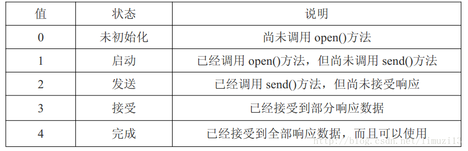
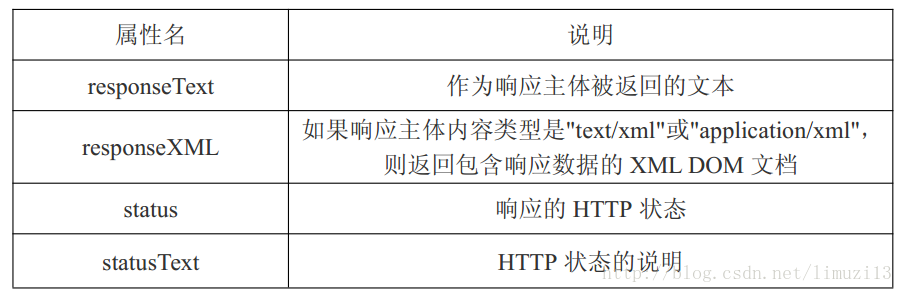

### 1.跨域

实现方式：`jsonp`,`CORS`,`websocket`,`postMessage`

#### jsonp

一句话阐述下JSONP原理：**动态生成一个JavaScript标签，其src由接口url、请求参数、callback函数名拼接而成，利用js标签没有跨域限制的特性实现跨域请求。** 

**Tips**：1.callback函数要绑定在window对象上
 2.服务端返回数据有特定格式要求：callback函数名+'('+JSON.stringify(返回数据) +')'
 3.不支持post，因为js标签本身就是一个get请求

```js
const jsonp = function(url, data) {
  return new Promise((resolve, reject) => {
    let dataString = url.indexOf("?") === -1 ? "?" : "&";
    let callbackName = `jsonp${Date.now()}`;
    url += `${dataString}callback=${callbackName}`;
    if (data) {
      // 如果有请求参数依次添加到url
      for (let k in data) {
        url += `&${k}=${data[k]}`;
      }
    }
    let jsNode = document.createElement("script");
    jsNode.src = url;
    // 添加节点到document上，进行请求
    document.body.appendChild(jsNode);
    // 触发callback，然后删除js标签和window上的callback
    window[callbackName] = result => {
      delete window[callbackName];
      document.body.removeChild(jsNode);
      if (result) {
        resolve(result);
      } else {
        reject(new Error("error"));
      }
    };
    // js加载异常情况
    jsNode.addEventListener("error", () => {
      delete window[callbackName];
      document.body.removeChild(jsNode);
      reject("js标签加载失败");
    });
  });
};

jsonp("http://192.168.0.103:8081/jsonp", { a: 1, b: "ok" })
  .then(result => {
    console.log(result);
  })
  .catch(err => {
    console.error(err);
  });
```

#### [CORS](http://www.ruanyifeng.com/blog/2016/04/cors.html)

浏览器把CORS分为两种，有简单请求和非简单请求：

```js
（1) 请求方法是以下三种方法之一：
HEAD
GET
POST
（2）HTTP的头信息不超出以下几种字段：
Accept
Accept-Language
Content-Language
Last-Event-ID
Content-Type：只限于三个值application/x-www-form-urlencoded、multipart/form-data、text/plain
```

对于简单请求，浏览器直接发出CORS请求。具体来说，就是在头信息之中，增加一个`Origin`字段。

如果`Origin`指定的源，不在许可范围内，服务器会返回一个正常的HTTP回应。浏览器发现，这个回应的头信息没有包含`Access-Control-Allow-Origin`字段，就知道出错了，从而抛出一个错误，被`XMLHttpRequest`的`onerror`回调函数捕获。注意，这种错误无法通过状态码识别，因为HTTP回应的状态码有可能是200。

##### cookie

CORS请求默认不发送Cookie和HTTP认证信息。如果要把Cookie发到服务器，一方面要服务器同意，指定`Access-Control-Allow-Credentials`字段。Ajax请求需要使用`xhr.withCredentials = true;`

非简单请求是那种对服务器有特殊要求的请求，比如请求方法是`PUT`或`DELETE`，或者`Content-Type`字段的类型是`application/json`。

非简单请求的CORS请求，会在正式通信之前，增加一次HTTP查询请求，称为"预检"请求（preflight）。

浏览器先询问服务器，当前网页所在的域名是否在服务器的许可名单之中，以及可以使用哪些HTTP动词和头信息字段。只有得到肯定答复，浏览器才会发出正式的`XMLHttpRequest`请求，否则就报错。

使用**WebSocket**实现跨域

>web sockets： 是一种浏览器的API，它的目标是在一个单独的持久连接上提供全双工、双向通信。(同源策略对web sockets不适用)
>web sockets原理：在JS创建了web socket之后，会有一个HTTP请求发送到浏览器以发起连接。取得服务器响应后，建立的连接会使用HTTP升级从HTTP协议交换为websocket协议。

```javascript
<script>
var socket = new WebSockt('ws://www.test.com');
//http->ws; https->wss
socket.send('hello WebSockt');
socket.onmessage = function(event){
    var data = event.data;
}
```

-  使用**window.postMessage**方法来跨域

>**window.postMessage(message,targetOrigin) 方法**是html5新引进的特性，可以使用它来向其它的window对象发送消息，无论这个window对象是属于同源或不同源(可实现跨域),支持到IE8
>
>**message：**为要发送的消息，类型只能为字符串； 
>**targetOrigin：**用来限定接收消息的那个window对象所在的域，如果不想限定域，可以使用通配符 “*”

### 2.原生Ajax和Fetch的区别

原生Ajax：

```js
var xhr = new XMLHTTPRequest();
// method表示通过什么方式进行服务器访问，包括get和post；url表示访问服务器的地址；
// async表示是否异步，包括true和false（注意：true表示异步）
xhr.open(method, url, async);
// content表示向服务器发送的数据
xhr.send(content);

xhr.onreadystatechange = function() {
  if (xhr.readystate == 4) {
    if (xhr.status == 200) {
      console.log(xhr.responseText);
    }
  }
};
```





### 3.GET/POST的区别

- **GET**一般用于**获取/查询**信息,**POST**用于**更新**信息,本质都属于**TCP**链接
- **GET**对数据长度有限制，当发送数据时，**GET** 方法向 **URL** 添加数据；**URL** 的长度是受限制的,这个限制来源于浏览器（**URL** 的最大长度是 2048 个字符）。**POST**无限制
- **GET**后退按钮/刷新无害，**POST**数据会被重新提交

### 4.浏览器输入URL到页面加载完毕发生了什么

1. 输入网址发送到**DNS**服务器,获取域名对应的web服务器的**IP**地址
2. 与服务器建立**TCP**连接,向服务器发送http请求
3. 服务器返回指定url对应的数据(**200**),重定向地址(**301,302**),或者错误信息(**404**)
4. 浏览器下载服务器返回的数据和html源文件
5. 浏览器生成DOM树,解析CSS和JS,渲染页面

