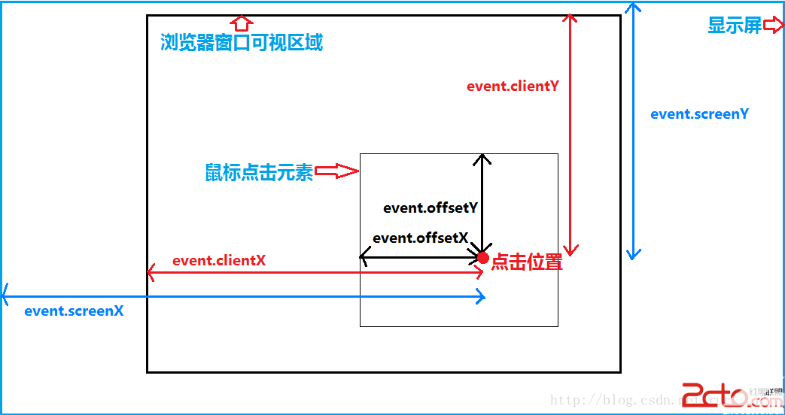
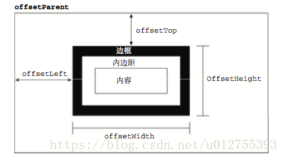
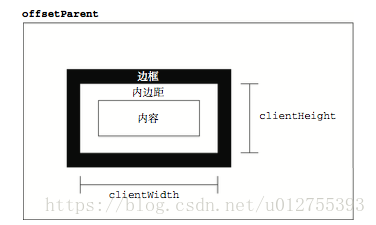
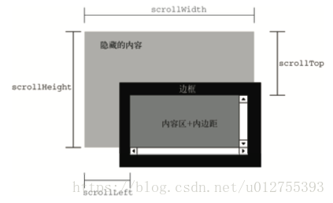

## Vue版本的拾色器

本文主要还是进行DOM操作，以及Vue的基础用法，以及`canvas`的简单入门。目前实现效果如下：


### 准备

- 如何实现点击某个区域获取对应区域的颜色的功能？
- 应该传入哪些参数？提供哪些参数？
- 支持哪几种颜色表现形式，以及使用`slide`来进行颜色选取的交互

### canvas获取颜色

首先要绘制两个canvas，一个用于获取对应颜色，一个用于选取对应颜色：

```js
// 颜色选取的canvas
function colorBar(canvas) {
  var ctx = canvas.getContext("2d");
  canvas.setAttribute("width", "256");
  canvas.setAttribute("height", "10");
  var gradient = ctx.createLinearGradient(0, 0, width, 0);

  gradient.addColorStop(0, "#f00");
  gradient.addColorStop(1 / 6, "#f0f");
  gradient.addColorStop(2 / 6, "#00f");
  gradient.addColorStop(3 / 6, "#0ff");
  gradient.addColorStop(4 / 6, "#0f0");
  gradient.addColorStop(5 / 6, "#ff0");
  gradient.addColorStop(1, "#f00");

  ctx.fillStyle = gradient;
  ctx.fillRect(0, 0, width, 10);
}
// 获取颜色的canvas
function colorBox(canvas, color) {
  var ctx = canvas.getContext("2d");
  canvas.setAttribute("width", "256");
  canvas.setAttribute("height", "256");
  // 第一次填充
  var my_gradient1 = ctx.createLinearGradient(0, 0, width, 0);
  my_gradient1.addColorStop(0, "rgba(255,255,255,1)");
  my_gradient1.addColorStop(1, color);
  ctx.fillStyle = my_gradient1;
  ctx.fillRect(0, 0, width, width);
  // 第二次填充
  var my_gradient2 = ctx.createLinearGradient(0, 0, 0, width);
  my_gradient2.addColorStop(0, "rgba(0,0,0,0)");
  my_gradient2.addColorStop(1, "rgba(0,0,0,1)");
  ctx.fillStyle = my_gradient2;
  ctx.fillRect(0, 0, width, width);
}
```

其中`ctx.createLinearGradient`是用于获取颜色填充区域，`my_gradient1.addColorStop`则类似于`linear-gradient`这个CSS属性。

#### 重点：获取颜色

没做之前，我也很好奇如何获取颜色，查询[MDN](https://developer.mozilla.org/zh-CN/docs/Web/API/Canvas_API/Tutorial/Pixel_manipulation_with_canvas)发现，canvas提供了`getImageData`,我们借助公式即可实现颜色的获取。为了兼容更多的浏览器，我采用了top和left实现标记的移动，而没有采用`transform`.

```js
function getBoxColor(canvas, pos) {
  var ctx = canvas.getContext("2d");
  var imgData = ctx.getImageData(0, 0, 256, 256);
  var data = imgData.data;
  // ((行数-1)*imageData.width + (列数-1))*4 - 1 + 1/2/3/4
  var dataIndex = (pos.y * imgData.width + pos.x) * 4;
  return [
    data[dataIndex],
    data[dataIndex + 1],
    data[dataIndex + 2],
    (data[dataIndex + 3] / 255).toFixed(2),
  ];
}
```

#### rbga与hex的互相转换

按照规则进行转换即可，不赘述。

```js
function rgb2hex(rgb) {
  var aRgb = rgb instanceof Array ? rgb : (rgb.split(',') || [0, 0, 0]);
  var temp;
  return [
    (temp = Number(aRgb[0]).toString(16)).length == 1 ? ('0' + temp) : temp,
    (temp = Number(aRgb[1]).toString(16)).length == 1 ? ('0' + temp) : temp,
    (temp = Number(aRgb[2]).toString(16)).length == 1 ? ('0' + temp) : temp,
  ].join('');
}

function hex2rgb(hex) {
  if (hex.length == 3) {
    hex = hex[0] + hex[0] + hex[1] + hex[1] + hex[2] + hex[2];
  }
  return [
    parseInt(hex[0] + hex[1], 16),
    parseInt(hex[2] + hex[3], 16),
    parseInt(hex[4] + hex[5], 16),
  ].join('');
}
```

#### slide滑动效果

实际上就是三个事件的结合,在标记上添加`mousedown`事件，注意要加上阻止冒泡，防止外部其他`mousedown`事件被响应，然后利用**事件委托**把`mouseup`和`mouseup`事件添加到window上，保证拖拽过程一定能够触发，在使用过程中为了判断是否是点击标记而产生拖拽，我们使用一个变量作为标志位进行标志。

距离判断则是使用`clientX - offsetLeft`可以计算出对应的挪动距离，然后改变对应的`left`的值。

```js
setBarAplhaDown(e) {
  // 标志位
  this.aplhaFlag = true;
  this.setBarAplhaMove(e);
},
setBarAplhaMove(e) {
  if (!this.aplhaFlag) return;
  this.setBarAplha(e);
},
clearAplhaUp() {
  this.aplhaFlag = false;
},
setBarAplha(e) {
  let x = e.clientX;
  var lineDiv_left = this.getPosition(this.$refs.aplha.parentNode).left;
  var minDiv_left = x - lineDiv_left;
  this.$refs.aplha.style["left"] = minDiv_left + "px";
  let aplha = "";
  if (minDiv_left >= 0 && minDiv_left < 256) {
    aplha = (minDiv_left / 256).toFixed(2);
  } else {
    return;
  }
  this.$refs.current.style["opacity"] = aplha;
}
//获取元素的绝对位置
getPosition(node) {
    var left = node.offsetLeft; //获取元素相对于其父元素的left值var left
    var top = node.offsetTop;
    var current = node.offsetParent; // 取得元素的offsetParent
    // 一直循环直到根元素
    while (current != null) {
        left += current.offsetLeft;
        top += current.offsetTop;
        current = current.offsetParent;
    }
    return {
        left: left,
        top: top
    };
}
```

### 总结

1. 了解canvas的部分api
2. 熟悉slider实现的DOM原理
3. Vue自定义指令和动画过渡
4. DOM位置相关属性详解









### 问题

参考Element发现并不是利用`canvas`实现的，应该有别的方式来完成输入框输入响应对应颜色

### 优化

- [ ] 添加其他颜色格式
- [ ] 输入框输入响应对应颜色
- [ ] 提供预选颜色，以及透明度设置
- [x] 优化颜色选取时输入框变化